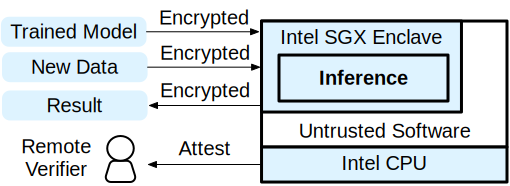

Privacy-Preserving Machine Learning in Intel SGX
###################################################

In this tutorial, we're going to walk you through an example of privacy-preserving machine learning (PPML).
We will show how you can use
`Intel SGX <https://www.intel.com/content/www/us/en/architecture-and-technology/software-guard-extensions.html>`_
and `Graphene <https://grapheneproject.io/>`_ to protect any private data
(e.g., models or inputs) in an  ML workload written in `PyTorch <https://pytorch.org>`_.

Introduction
------------

Machine learning has started to solve many of problems in our daily lives based on a tremendous amount of data. The more we want to use ML, the more data will be needed, thus data confidentiality became one of the key issues.
Moreover, many of the trained ML models are becoming key assets to companies and governments.

.. image:: ./img/intro-01.svg
   :target: ./img/intro-01.svg
   :alt: Figure: Training and Inference

In general, machine learning workloads have two phases: *training* and *inference* as shown above.
Training takes a *dataset* as an input, and produces a *model*\ , a set of parameters that will be used for inference.
Inference takes user data as an input and outputs the best interpretation of the input based on the trained model.

PPML preserves the privacy (confidentiality) of data while performing training or inference.
Here are several example scenarios that may require PPML.

Training Models with Private Data
~~~~~~~~~~~~~~~~~~~~~~~~~~~~~~~~~

Netflux provides a personalized contents recommendation system for each of the user, but they want to train their models without collecting any of the user data directly because their customers don't want Netflux to use their data for marketing.
In this case, the training workload may receive and consume user data to train the model, but should never allow the data to be used for other purposes.

Proprietary Models
~~~~~~~~~~~~~~~~~~

Abode developed a video editing application with a patented ML-based object detection feature. The application will run on the client side, thus the customer's data will never leave the local computer. However, Abode is worried that their model for the feature could be leaked by their competitor.

Inference with Private Data
~~~~~~~~~~~~~~~~~~~~~~~~~~~

Goggle has trained a pretty good model that predicts the road traffic based on the real-time GPS information of a few nearby users. Goggle wants to provide a Goggle Maps service using this model.
However, collecting the real-time location of individuals violates the privacy law.
Goggle somehow needs to make sure that the customers' GPS data will not be disclosed even for themselves, but still wants the data to predict the traffic.

A fundamental challenge of these examples is that the computation may take place on a platform that the data owner doesn't necessarily trust.
The data owner somehow needs to send her input or model to the remote computers, which are owned by an untrusted entity.

One promising solution is to use *hardware enclave* such as the ones provided by the Intel SGX technology.
Intel SGX guarantees that the remote execution of a program is cryptographically attested by Intel hardware
and the hardware provides the integrity and confidentiality of the execution.

See below for how we can apply SGX to PPML scenarios.

Once the data owner successfully verifies the enclave via remote attestation protocol, she can now trust the enclave.
She can send the encrypted data and the shared key via the channel bound with the enclave.
Then, the enclave performs the computation and sends the results back to the remote user.

With Intel SGX, one can protect *any* inputs to a program execution; she can protect training data, inference data, proprietary model, or a combination of all of them.
In this tutorial, we will walk you through a simple example of privacy-preserving inference with PyTorch,
which takes a pre-trained neural network model and an image, and generates the classification result.
We will show you how you can use Graphene and Intel SGX to perform the computation entirely inside an enclave.
All of the inputs and the output will be encrypted outside of the enclave such that no one -- the platform owner, co-tenants, or even Intel -- can reveal them.

Prerequisites
-------------

* **PyTorch (Python3)**

  * PyTorch is a framework for machine learning based on Python. Please `install PyTorch <https://pytorch.org/get-started/locally/>`_ before you proceed. We will use Python3 in this tutorial.

* **Intel SGX SDK & Platform Software**

  * You need a machine that supports Intel SGX. Please follow `this guide <https://download.01.org/intel-sgx/latest/linux-latest/docs/Intel_SGX_Installation_Guide_Linux_2.10_Open_Source.pdf>`_ to install Intel SGX SDK and Platform Software. Make sure to install the driver with ECDSA attestation enabled.

* **Graphene**

  * Graphene can host unmodified binaries inside Intel SGX enclaves. Follow `Quick Start <https://graphene.readthedocs.io/en/latest/quickstart.html>`_ to build Graphene.

PyTorch Base Example
--------------------

We start with an example inferencing python script written with PyTorch.

Go to the directory that contains `Graphene repository <https://github.com/oscarlab/graphene>`_ you've cloned in the previous section.

.. code-block:: bash

   cd <graphene repository>

There is ``Examples`` directory containing example workloads. Go to ``Examples/pytorch``

.. code-block:: bash

   cd Examples/pytorch

The directory contains a python script ``pytorchexample.py`` and relevant files.
The script reads a `pretrained model <https://pytorch.org/docs/stable/torchvision/models.html>`_  of AlexNet, and an image ``input.jpg``\ , and infers the class of an object in the image.
Then, the script writes the top-5 classification result to a file ``result.txt``.

To run the python script, install required packages for the script.

.. code-block:: bash

   sudo apt-get install python3-pip lsb-release
   pip3 install --user torchvision

Next, download and save the pre-trained model.

.. code-block:: bash

   make download_model

This uses ``download-pretrained-model.py`` to download a pretrained model and saves it as a serialized file ``alexnet-pretrained.pt``. See `Saving and Loading Models in PyTorch <https://pytorch.org/tutorials/beginner/saving_loading_models.html>`_ for more details.

Now, you can simply run following command to run the script

.. code-block:: bash

   python3 pytorchexample.py

This will write the classification results to ``result.txt``.

In later sections, we will run exactly the same Python script, but inside SGX enclaves.

PyTorch with Graphene
---------------------

Now, we will run the previous example with `Graphene <https://grapheneproject.io/>`_ open-source library OS.
Graphene allows an unmodified binary to run on different platforms, including Intel SGX enclaves.

When Graphene runs an executable, it reads a *manifest file* that describes the execution environment including the security posture, environment variables, dynamic libraries, arguments, and so on.
Graphene supports seamless porting of an application into an Intel SGX enclave based on the manifest.
For SGX enclaves, the manifest should also include the hashes of all dependent libraries and trusted files such that the adversary cannot tamper with them.
Please refer to `this <https://graphene.readthedocs.io/en/latest/manifest-syntax.html>`_ for further details about the syntax of Graphene manifests.

Before you start, please see :ref:`Prerequisites` and make sure you have built both of the Graphene loaders (\ ``Runtime/pal-Linux`` and ``Runtime/pal-Linux-SGX``\ ).

Putting PyTorch into Graphene Library OS
^^^^^^^^^^^^^^^^^^^^^^^^^^^^^^^^^^^^^^^^

Now, we will run the previous example using Graphene library OS.

Navigate to the PyTorch example directory that we were in the previous section.

.. code-block:: bash

   cd <graphene repository>/Examples/pytorch

Now, take a look at the template manifest file ``pytorch.manifest.template``.
We will take a look at only a few entries of the file.

The executable is ``python3``\ , which is located at the host path ``/usr/bin/python3``\ :

.. code-block:: text

   loader.exec = file:/usr/bin/python3

We will mount the entire ``$(GRAPHENEDIR)/Runtime/``  directory to the ``/lib`` in the library OS:

.. code-block:: text

   fs.mount.lib.type = chroot
   fs.mount.lib.path = /lib
   fs.mount.lib.uri = file:$(GRAPHENEDIR)/Runtime/

We also mount other directories such as ``/usr``\ ,  ``/etc``\ , and ``/tmp``.
Finally, we mount the path containing the python packages:

.. code-block:: text

   fs.mount.pip.type = chroot
   fs.mount.pip.path = $(HOME)/.local/lib
   fs.mount.pip.uri = file:$(HOME)/.local/lib

For now, ignore the entries starting with ``sgx``.

Now,  if you run ``make``\ , it will perform the following:

#. Generate the actual manifest (\ ``pytorch.manifest``\ ) from the template
#. Create a symbolic link of the Graphene loader (\ ``pal_loader``\ )

.. code-block:: bash

   make

Now, launch Graphene with the generated manifest.
You can simply append the arguments after the manifest name.
Our example takes ``pytorchexample.py`` as an argument:

.. code-block:: bash

   ./pal_loader pytorch.manifest pytorchexample.py

That's it. You have run the PyTorch example with Graphene.

Executing in an SGX Enclave
^^^^^^^^^^^^^^^^^^^^^^^^^^^

In this section, we will learn how to use Graphene to run the same PyTorch example inside an Intel SGX enclave.
Let's go back to the manifest template.

Please note that the manifest keys starting with ``sgx`` are SGX-specific syntax.
These entries are ignored if Graphene is not running with SGX.

Again, we will highlight some of the SGX-specific entries in ``pytorch.manifest.template``.
SGX syntax is fully described in `here <https://graphene.readthedocs.io/en/latest/manifest-syntax.html?highlight=manifest#sgx-syntax>`_.

First, you may see the following lines in the manifest template.

.. code-block:: text

   sgx.trusted_files.ld = file:$(GRAPHENEDIR)/Runtime/ld-linux-x86-64.so.2
   sgx.trusted_files.libc = file:$(GRAPHENEDIR)/Runtime/libc.so.6
   ...

``sgx.trusted_files.<name>`` specifies the file that will be verified, thus trusted by the enclave.
Before we run the enclave, we generate the actual SGX manifest file
with ``pal-sgx-sign`` utility.
The utility will calculate the hash of each trusted file and append ``sgx.trusted_checksum.<name>``.

On the other hand, ``sgx.allowed_files.<name>`` specifies a file that will be unconditionally allowed by the enclave.
The file will not be cryptographically hashed and verified.
Thus, this is insecure and discouraged for production use (unless you are sure that the contents of the file are irrelevant to security of your workload).

.. code-block:: text

   sgx.allowed_files.pythonhome = file:$(HOME)/.local/lib

This line unconditionally allows all python libraries in the path to be loaded into the enclave.
Ideally, the developer needs to replace it with ``sgx.trusted_files`` for each of the dependent python libraries.
Note that our example is using ``sgx.allowed_files`` for simplicity.

.. code-block:: text

   sgx.allow_file_creation = 1

This allows the enclave to generate new files.
We need this as the python script writes the result to ``result.txt``.

So far, we saw how the manifest template looks like.
We will now prepare all the files needed to run the program in SGX enclaves.

.. code-block:: bash

   make SGX=1

Above command will do the following:

#. Generate the SGX manifest file ``pytorch.manifest.sgx``
#. Sign the manifest and generate the signature file (\ ``pytorch.sig``\ )
#. Retrieve ``aesmd`` token and write it to ``pytorch.token``

After the command, you can simply set ``SGX=1`` environment variable and use ``pal_loader`` to launch the application with an SGX enclave.

.. code-block:: bash

   SGX=1 ./pal_loader pytorch.manifest.sgx pytorchexample.py

It will run exactly the same python script, but inside the SGX enclave!

PPML Tutorial
-------------

Remote Attestation, RA-TLS and Secret Provisioning
^^^^^^^^^^^^^^^^^^^^^^^^^^^^^^^^^^^^^^^^^^^^^^^^^^

A very important aspect of any SGX workload is attestation. How can a remote user verify that her
application actually *runs in a correct up-to-date SGX enclave*\ , and that the code that runs inside
the enclave is the *actual user application*\ ? Moreover, how can the remote user provision any secret
inputs to the application remotely and in a secure fashion and get the results of execution (also in
a secure fashion) back?

Intel SGX provides a way for the SGX enclave to attest itself to the remote user. This way the user
gains trust in the SGX enclave running in an untrusted environment, ship the application code and
data, and be sure that the *correct* application was executed inside a *genuine* SGX enclave. This
process of gaining trust in a remote SGX machine is called *remote attestation*.

Graphene contains two libraries that transparently add Remote Attestation to the application:

#.
   *The RA-TLS library* augments normal SSL/TLS sessions with an SGX-specific handshake callback.

#.
   *The Secret Provisioning library* establishes a secure SSL/TLS session between the SGX enclave
   and the remote user so that the user may gain trust in the remote enclave and provision secrets
   to it. The Secret Provisioning library builds on top of RA-TLS and typically runs before the
   application.

The Secret Provisioning library provides two simple APIs to applications: it either transparently
initializes the environment variable ``SECRET_PROVISION_SECRET_STRING`` with a secret obtained from
the remote user or provides C function APIs to receive secrets at any point during runtime.

Typical secrets that the user provisions to the remote SGX enclave include:

* Encryption keys (to encrypt/decrypt files, network connections, etc.);
* User credentials (usernames, passwords, tokens);
* Command-line arguments and environment variables;
* Configuration options.

For most applications, it is sufficient to preload the Secret Provisioning library (which will
automatically perform remote attestation with remote user and obtain the secret) and query the
``SECRET_PROVISION_SECRET_STRING`` environment variable.

For more information on remote attestation, RA-TLS and Secret Provisioning, refer to
`this page <>`_.

Let's build the secret provisioning library and the secret provisioning server.

In this tutorial, we assume the DCAP-enabled platform (not the legacy EPID-based platform).

.. code-block:: bash

   cd Examples/ra-tls-secret-prov/

You first need to build the required library for DCAP.

.. code-block:: bash

   make -C ../../Pal/src/host/Linux-SGX/tools/ra-tls dcap

This will create ``libsecret_prov_verify_dcap.so``.

Now, build the binaries and copy the required libraries.

.. code-block:: bash

   make dcap pf_crypt

This builds several binaries including ``secret_prov_server_dcap``\ , which is a secret provisioning server.
We will use this server to provision the secret master key to encrypt/decrypt protected input and output files used by PyTorch.

See `Secret Provisioning Minimal Examples <https://github.com/oscarlab/graphene/tree/master/Examples/ra-tls-secret-prov>`_ for a detailed description of this example.

Protected File System
^^^^^^^^^^^^^^^^^^^^^

Graphene provides `Protected File System <https://graphene.readthedocs.io/en/latest/manifest-syntax.html?highlight=protected#protected-files>`_\ , which encrypts files and transparently decrypts them when the application reads or writes them.
This can be combined with Secret Provisioning such that the files are decrypted using the provisioned wrap key.

Privacy-Preserving Machine Learning
^^^^^^^^^^^^^^^^^^^^^^^^^^^^^^^^^^^

Finally, we will transform our native PyTorch application into a privacy-preserving application.
We will encrypt all the files before we launch the enclave, and let the enclave communicate with the secret provisioning server to get attested and receive the master key for encryption and decryption of protected files.

We will start with the previous example, so copy the entire PyTorch directory.

.. code-block:: bash

   cd Examples
   cp -R pytorch ppml
   cd ppml

First, we will encrypt all input files: ``input.jpg``\ , ``classes.txt``\ , and ``alexnet-pretrained.pt``.
For simplicity, we will use the previously-built server in ``Examples/ra-tls-secret-prov`` directory.
By default, the server loads the secret key from files/wrap-key and provisions it to the PyTorch application. Therefore, we need to encrypt our files with the same key.

Encrypt Input Files
~~~~~~~~~~~~~~~~~~~

Move original files to a folder:

.. code-block:: bash

   mkdir plaintext
   mv input.jpg classes.txt alexnet-pretrained.pt plaintext

We will first copy the required files from ``Examples/ra-tls-secret-prov``.

.. code-block:: bash

   cp ../ra-tls-secret-prov/libsgx_util.so .
   cp ../ra-tls-secret-prov/pf_crypt .
   cp ../ra-tls-secret-prov/files/wrap-key .

Now encrypt our files with the wrap key stored in ``wrap-key``\ , using the ``pf_crypt`` utility provided by Graphene.

.. code-block:: bash

   LD_LIBRARY_PATH=. ./pf_crypt encrypt -w ./wrap-key -i ./plaintext/input.jpg -o input.jpg
   LD_LIBRARY_PATH=. ./pf_crypt encrypt -w ./wrap-key -i ./plaintext/classes.txt -o classes.txt
   LD_LIBRARY_PATH=. ./pf_crypt encrypt -w ./wrap-key -i ./plaintext/alexnet-pretrained.pt -o alexnet-pretrained.pt

Prepare Secret Provisioning
~~~~~~~~~~~~~~~~~~~~~~~~~~~

Copy the secret provisioning attest library from ``Examples/ra-tls-secret-prov`` to the current directory.
This library provides the logic to attest the SGX enclave, Graphene instance, and the application
running in it to the remote secret-provisioning server.

.. code-block:: bash

   cp ../ra-tls-secret-prov/libsecret_prov_attest.so ./

Also, copy the certificates so that Graphene can verify the provisioning server.
These certificates are dummy mbedTLS-provided certificates; in production, you would want to generate real certificates for your secret-provisioning server and use them.

.. code-block:: bash

   cp -R ../ra-tls-secret-prov/certs ./

Lastly, install the dependent libraries.

.. code-block:: bash

   sudo apt-get install libnss-mdns libnss-myhostname

Change Manifest File
~~~~~~~~~~~~~~~~~~~~

Next, we'll change the manifest file.
Open ``pytorch.manifest.template`` with your favorite text editor.

Replace ``trusted_files`` with ``protected_files`` for the input files.

.. code-block:: text

   # replace this line with the following line
   # sgx.trusted_files.model = file:alexnet-pretrained.pt
   sgx.protected_files.model = file:alexnet-pretrained.pt

.. code-block:: text

   # replace this line with the following line
   # sgx.trusted_files.image = file:input.jpg
   sgx.protected_files.image = file:input.jpg

.. code-block:: text

   # replace this line with the following line
   # sgx.trusted_files.classes = file:classes.txt
   sgx.protected_files.classes = file:classes.txt

Also add ``result.txt`` as a protected file so that the application can write the encrypted result into it.

.. code-block:: text

   sgx.protected_files.result = file:result.txt

Now, let's add the secret provisioning library to the manifest.

Append current directory ``./`` to ``LD_LIBRARY_PATH``.

.. code-block:: text

   # search for LD_LIBRARY_PATH and add ":./" at the end of the line
   # this instructs in-Graphene dynamic loader to search for dependencies in the current directory
   loader.env.LD_LIBRARY_PATH = /lib:/usr/lib:$(ARCH_LIBDIR):/usr/$(ARCH_LIBDIR):./

Add the following lines to enable remote secret provisioning and allow protected files to be transparently decrypted by the provisioned key.

.. code-block:: text

   loader.env.LD_PRELOAD = libsecret_prov_attest.so
   loader.env.SECRET_PROVISION_CONSTRUCTOR = 1
   loader.env.SECRET_PROVISION_SET_PF_KEY = 1
   loader.env.SECRET_PROVISION_CA_CHAIN_PATH = "certs/test-ca-sha256.crt"
   loader.env.SECRET_PROVISION_SERVERS = "localhost:4433"

   sgx.trusted_files.libsecretprovattest = file:libsecret_prov_attest.so
   sgx.trusted_files.cachain = file:certs/test-ca-sha256.crt
   sgx.remote_attestation = 1

Add the following lines for additional dynamic libraries used for secret provisioning.

.. code-block:: text

   sgx.trusted_files.libnssdns = file:$(GRAPHENEDIR)/Runtime/libnss_dns.so.2
   sgx.trusted_files.libnssmyhostname = file:$(ARCH_LIBDIR)/libnss_myhostname.so.2
   sgx.trusted_files.libnssmdns = file:$(ARCH_LIBDIR)/libnss_mdns4_minimal.so.2

The following files should be also allowed for DNS hostname resolution.
Note that ``sgx.allowed_files`` should not be used in production.
In practice, you will need to have the expected values for these files, and use ``sgx.trusted_files``.

.. code-block:: text

   sgx.allowed_files.hostconf = file:/etc/host.conf
   sgx.allowed_files.hosts = file:/etc/hosts
   sgx.allowed_files.gaiconf = file:/etc/gai.conf
   sgx.allowed_files.resolv = file:/etc/resolv.conf

Re-generate the manifest files, tokens, and signatures:

.. code-block:: bash

   make clean
   make SGX=1

Now, you are ready to run your privacy-preserving PyTorch example!

Run Privacy-Preserving Inference
~~~~~~~~~~~~~~~~~~~~~~~~~~~~~~~~

We will launch the provisioning server.

In this tutorial, we will just run it locally (\ ``localhost:4433`` as configured in the manifest) for simplicity.
As previously mentioned, we will use the reference server from ``Examples/ra-tls-secret-prov``.

Ideally, the user must run it on a trusted remote machine.
In that case, ``loader.env.SECRET_PROVISION_SERVERS`` in the manifest must point to the address of the machine.

.. code-block:: bash

   cd ../ra-tls-secret-prov
   ./secret_prov_server_dcap &
   cd -

Finally, let's run the application.
You don't need to change anything in the python script.
Actually, you can run it with exactly the same command you ran in the previous section.

.. code-block:: bash

   SGX=1 ./pal_loader pytorch.manifest pytorchexample.py

Decrypt the Output File
~~~~~~~~~~~~~~~~~~~~~~~

After our protected PyTorch inference is finished, you'll see ``result.txt`` in the directory.
This file is encrypted with the same key as was used for decryption of input files.
In order to decrypt it, use the following command:

.. code-block:: bash

   LD_LIBRARY_PATH=../ra-tls-secret-prov ../ra-tls-secret-prov/pf_crypt decrypt -w ../ra-tls-secret-prov/files/wrap-key -i ./result.txt -o plaintext/result.txt

You can check the result written in ``./plaintext/result.txt``\ !

Cleaning Up
~~~~~~~~~~~

If you're done, kill the provisioning server

.. code-block:: bash

   kill %%
