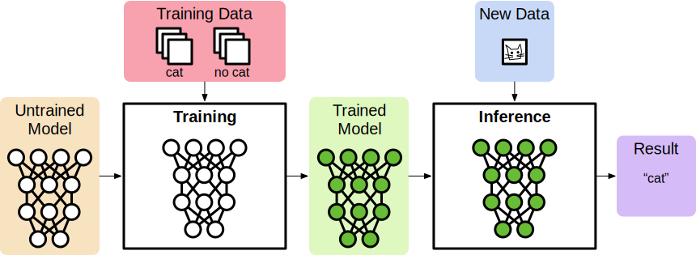
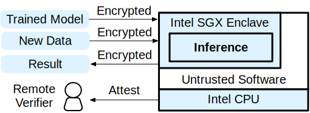

## Introduction

Machine learning has started to solve many of problems in our daily lives based on a tremendous amount of data. The more we want to use ML, the more data will be needed, thus data confidentiality became one of the key issues.
Moreover, many of the trained ML models are becoming key assets to companies and governments.

In general, machine learning workloads have two phases: *training* and *inference* as shown above.
Training takes a *dataset* as an input, and produces a *model*, a set of parameters that will be used for inference.
Inference takes user data as an input and outputs the best interpretation of the input based on the trained model.

PPML preserves the privacy (confidentiality) of data while performing training or inference.
Here are several example scenarios that may require PPML.

#### Training Models with Private Data
Netflux provides a personalized contents recommendation system for each of the user, but they want to train their models without collecting any of the user data directly because their customers don't want Netflux to use their data for marketing.
In this case, the training workload may receive and consume user data to train the model, but should never allow the data to be used for other purposes.

#### Proprietary Models
Abode developed a video editing application with a patented ML-based object detection feature. The application will run on the client side, thus the customer's data will never leave the local computer. However, Abode is worried that their model for the feature could be leaked by their competitor.

#### Inference with Private Data
Goggle has trained a pretty good model that predicts the road traffic based on the real-time GPS information of a few nearby users. Goggle wants to provide a Goggle Maps service using this model.
However, collecting the real-time location of individuals violates the privacy law.
Goggle somehow needs to make sure that the customers' GPS data will not be disclosed even for themselves, but still wants the data to predict the traffic.

A fundamental challenge of these examples is that the computation may take place on a platform that the data owner doesn't necessarily trust.
The data owner somehow needs to send her input or model to the remote computers, which are owned by an untrusted entity.

One promising solution is to use *hardware enclave* such as the ones provided by the Intel SGX technology.
Intel SGX guarantees that the remote execution of a program is cryptographically attested by Intel hardware
and the hardware provides the integrity and confidentiality of the execution.

See below for how we can apply SGX to PPML scenarios.

Once the data owner successfully verifies the enclave via remote attestation protocol, she can now trust the enclave.
She can send the encrypted data and the shared key via the channel bound with the enclave.
Then, the enclave performs the computation and sends the results back to the remote user.

With Intel SGX, one can protect *any* inputs to a program execution; she can protect training data, inference data, proprietary model, or a combination of all of them.
In this tutorial, we will walk you through a simple example of privacy-preserving inference with PyTorch,
which takes a pre-trained neural network model and an image, and generates the classification result.
We will show you how you can use Graphene and Intel SGX to perform the computation entirely inside an enclave.
All of the inputs and the output will be encrypted outside of the enclave such that no one -- the platform owner, co-tenants, or even Intel -- can reveal them.
