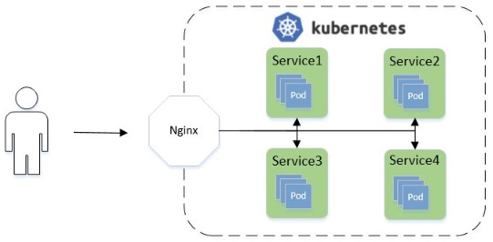
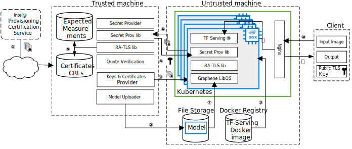

========================================
TensorFlow Serving Cluster PPML Tutorial
========================================

.. highlight:: sh

This tutorial presents a framework for developing a PPML (Privacy-Preserving
Machine Learning) solution - `TensorFlow Serving <https://www.tensorflow.org/tfx/guide/serving>`__
cluster with Intel SGX and Graphene.

.. warning::

   This tutorial is an external contribution and wasn't reviewed as thoroughly
   as the rest of the code. Please be careful, especially in terms of security!

Introduction
------------

Simply running a TensorFlow Serving system inside Graphene is not enough for a
safe & secure end-user experience. Thus, there is a need to build a complete
secure inferencing flow. This tutorial will present TensorFlow Serving with Intel
SGX and Graphene and will provide end-to-end protection (from client to servers)
and integrate various security ingredients such as the load balancer (Nginx
Ingress) and elastic scheduler (Kubernetes). Please refer to `What is Kubernetes
<https://www.redhat.com/en/topics/containers/what-is-kubernetes>`__ for more
details.

In this tutorial, we focus on:

- AI Service - TensorFlow Serving, a flexible, high-performance serving system
  for machine learning models.
- Model protection - protecting the confidentiality and integrity of the model
  when the inference takes place on an untrusted platform such as a public cloud
  virtual machine.
- Data protection - establishing a secure communication link from end-user to
  TensorFlow Serving when the user doesn’t trust the remote platform where the
  TensorFlow Serving system is executing.
- Platform Integrity - providing a way for Intel SGX platform to attest itself
  to the remote user, so that she can gain trust in the remote SGX platform.
- Elasticity - providing the Kubernetes service for automating deployment,
  scaling, and management of containerized TensorFlow Serving so that the cloud
  providers can setup the environment easily. We use Nginx for automatic load
  balancing.

The goal of this tutorial is to show how these applications - TensorFlow Serving
and Kubernetes - can run in an untrusted environment (like a public cloud),
automating deployment while still ensuring the confidentiality and integrity of
sensitive input data and the model. To this end, we use Intel SGX enclaves to
isolate TensorFlow Serving's execution to protect data confidentiality and
integrity, and to provide a cryptographic proof that the program is correctly
initialized and running on legitimate hardware with the latest patches. We also
use Graphene to simplify the task of porting TensorFlow Serving to SGX, without
any changes.

In this tutorial, we use three machines: ``Machine A`` is the trusted machine,
it can be a non-SGX platform or an SGX platform; ``Machine B`` is SGX-enabled,
treated as untrusted machine; ``Machine C`` is the client.
Here we will show the complete workflow for using Kubernetes to manage the
TensorFlow Serving running inside an SGX enclave with Graphene and its
features of Secret Provisioning and Protected Files.
We rely on the new ECDSA/DCAP remote attestation scheme developed by Intel for
untrusted cloud environments.

To run the TensorFlow Serving application on a particular SGX platform, the owner
of the SGX platform must retrieve the corresponding SGX certificate from the Intel
Provisioning Certification Service, along with Certificate Revocation Lists (CRLs)
and other SGX-identifying information **①**. Typically, this is a part of provisioning
the SGX platform in a cloud or a data center environment, and the end user can
access it as a service (in other words, the end user doesn’t need to deal with
the details of this SGX platform provisioning but instead uses a simpler interface
provided by the cloud/data center vendor).

As a second preliminary step, the user must encrypt model files with her cryptographic
(wrap) key and send these protected files to the remote storage accessible from
the SGX platform **②**.

Next, the untrusted remote platform uses Kubernetes to start TensorFlow Serving
inside of the SGX enclave **③**. Meanwhile, the user starts the secret provisioning
application on her own machine. The three machines establish a TLS connection using
RA-TLS **④**, the user verifies that the untrusted remote platform has a genuine
up-to-date SGX processor and that the application runs in a genuine SGX enclave
**⑤**, and finally provisions the cryptographic wrap key to this untrusted remote
platform **⑥**. Note that during build time, Graphene informs the user of the
expected measurements of the SGX application.

After the cryptographic wrap key is provisioned, the untrusted remote platform may
start executing the application. Graphene uses Protected FS to transparently
decrypt the model files using the provisioned key when the TensorFlow Serving
application starts **⑦**. TensorFlow Serving then proceeds with execution on
plaintext files **⑧**. The client and the TensorFlow Serving will establish a
TLS connection using gRPC TLS with the key and certificate generated by the
client **⑨**. The Nginx load balancer will monitor the requests from the client
**⑩**, and will forward external requests to TensorFlow Serving **⑪**.
When TensorFlow Serving completes the inference, it will send back the result to
the client through gRPC TLS **⑫**.

Prerequisites
-------------

- Ubuntu 18.04. This tutorial should work on other Linux distributions as well,
  but for simplicity we provide the steps for Ubuntu 18.04 only.

  Please install the following dependencies::

     sudo apt install libnss-mdns libnss-myhostname

- Docker Engine. Docker Engine is an open source containerization technology for
  building and containerizing your applications. In this tutorial, applications,
  like Graphene, TensorFlow Serving, secret providers, will be built in Docker
  images. Then Kubernetes will manage these Docker images.
  Please follow `this guide <https://docs.docker.com/engine/install/ubuntu/#install-using-the-convenience-script>`__
  to install Docker engine.

- Python3. Please install python3 package since our python script is based on
  python3.

- TensorFlow Serving. `TensorFlow Serving <https://www.TensorFlow.org/tfx/guide/serving>`__
  is a flexible, high-performance serving system for machine learning models,
  designed for production environments. Install::

     pip3 install -r ./tensorflow-serving/client/requirements.txt

- Kubernetes. `Kubernetes <https://kubernetes.io/docs/concepts/overview/what-is-kubernetes/>`__
  is an open-source system for automating deployment,
  scaling, and management of containerized applications. In this tutorial, we
  will provide a script (``install_kubernetes.sh``) to install Kubernetes in your
  machine.

- Intel SGX Driver and SDK/PSW. You need a machine that supports Intel SGX and
  FLC/DCAP. Please follow `this guide <https://download.01.org/intel-sgx/latest/linux-latest/docs/Intel_SGX_Installation_Guide_Linux_2.10_Open_Source.pdf>`__
  to install the Intel SGX driver and SDK/PSW. Make sure to install the driver with ECDSA/DCAP attestation.

- Graphene. Follow `Quick Start <https://graphene.readthedocs.io/en/latest/quickstart.html>`__
  to build Graphene. In this tutorial, we will need to build Graphene in the
  host to get the tool ``pf_crypt``, which will be used to encrypt the model file.

- TensorFlow Serving cluster scripts package. You can download the scripts package
  ``tensorflow-serving-cluster`` `here <https://github.com/oscarlab/graphene-contrib.git>`__.

Executing TF Serving in Docker
------------------------------

We start with TensorFlow Serving running in Docker directly without Graphene.
This example does not have confidentiality guarantees for model files and does
not use remote attestation. In this tutorial, we will start from this example as
a basis and will improve it to protect the files and involve Kubernetes.

Executing TF Serving without Graphene in Docker
~~~~~~~~~~~~~~~~~~~~~~~~~~~~~~~~~~~~~~~~~~~~~~~

Under the untrusted machine B, clone the GitHub repository with our provided
scripts and go to the directory::

   git clone https://github.com/oscarlab/graphene-contrib.git
   cd ./graphene-contrib/tensorflow-serving-cluster/tensorflow-serving

Preparing the Docker image
^^^^^^^^^^^^^^^^^^^^^^^^^^

First, use ``download_model.sh`` to download the model file.

It will create the directory: ``models/resnet50-v15-fp32``.

The model file will be downloaded to ``models/resnet50-v15-fp32``. After the
model is downloaded, use ``model_graph_to_saved_model.py`` to convert the model
file. 

Please replace ``${models_abs_dir}`` with the absolute path of your current
directory ``models``::

   ./download_model.sh
   pip3 install tensorflow==2.4.0
   python3 ./model_graph_to_saved_model.py --import_path ${models_abs_dir}/resnet50-v15-fp32/resnet50-v15-fp32.pb --export_dir ${models_abs_dir}/resnet50-v15-fp32 --model_version 1 --inputs input --outputs predict

The converted model file will be under::

   models/resnet50-v15-fp32/1/saved_model.pb

Next, we will pull the Docker image of TensorFlow Serving.

For example::

   docker pull tensorflow/serving:2.4.0

You can check the Docker image with below command::

   docker images

Image will look something like below::

   REPOSITORY          TAG      IMAGE ID        CREATED        SIZE
   tensorflow/serving  2.4.0    ffd2e2a4853e    5 seconds ago  298MB

Now, we get the Docker image. When we use ``run_tf_serving.sh`` to start the
Docker, it will call ``tf_serving_entrypoint.sh`` to start TensorFlow Serving.
Then, we can send the inference request from the client.

Preparing the TLS certificate
^^^^^^^^^^^^^^^^^^^^^^^^^^^^^

We choose gRPC TLS and create the one-way TLS Keys and certificates by setting
TensorFlow Serving domain name to establish a communication link between client
and TensorFlow Serving.
This domain name will be also used in machine A (the client).

For example::

   service_domain_name=grpc.tf-serving.service.com
   ./generate_ssl_config.sh ${service_domain_name}

It will generate ``server.crt``, ``server.key`` and ``ssl.cfg``.
``server.crt`` will be used by the client and ``ssl.cfg`` will be used by TF Serving.

Executing the TensorFlow Serving
^^^^^^^^^^^^^^^^^^^^^^^^^^^^^^^^

Start TensorFlow Serving in untrusted machine B::

   ./run_tf_serving.sh -a ${image_id} -b 8500-8501 -c resnet50-v15-fp32 -d ssl.cfg

*Note*: ``image_id`` is the new pulled Docker image;
``8500-8501`` are the ports created on (bound to) the host, you can change them
if you need.

Now, the TensorFlow Serving service in the Docker is running and waiting for
requests from the client.

To run the client, under the untrusted machine C, clone the GitHub repository
with our provided scripts and go to the directory::

   git clone https://github.com/oscarlab/graphene-contrib.git
   cd ./graphene-contrib/tensorflow-serving-cluster/tensorflow-serving

Please copy the ``ssl_configure/server.crt`` generated under ``tensorflow-serving``
in machine B to machine C.

Then, add the mapping of the machine B's IP address to Tensorflow Serving domain
name before DNS can be referenced.

For example::

   machineB_ip_addr=XX.XX.XX.XX
   service_domain_name=grpc.tf-serving.service.com
   echo "${machineB_ip_addr} ${service_domain_name}" >> /etc/hosts

*Note*: Please make sure that the connection between machines A and B is good.
``machineB_ip_addr`` is the IP address of machine B; ``service_domain_name``
is a domain name of TensorFlow Serving installed on machine B.

Start the client request with dummy image::

   python3 ./resnet_client_grpc.py -url ${service_domain_name}:8500 -crt `pwd -P`/ssl_configure/server.crt -batch 1 -cnum 1 -loop 50

You can get the inference result printed in the terminal window.
In later sections, we will run TensorFlow Serving with Graphene inside
SGX enclaves.

Executing TF Serving with Graphene in SGX Enclave in Docker
~~~~~~~~~~~~~~~~~~~~~~~~~~~~~~~~~~~~~~~~~~~~~~~~~~~~~~~~~~~

In this section, we will learn how to use Graphene to run the TensorFlow Serving
inside an Intel SGX enclave.

Please make sure that SGX is already enabled in your platform.

Downloading the model was already described in the previous section, so let's
start with creating a new Docker image.

We use ``build_graphene_tf_serving.sh`` to create Docker image with Graphene.

First, we want to highlight some options:

In ``tensorflow_model_server.manifest.noattestation.template``, the manifest keys
starting with ``sgx.`` are SGX-specific syntax; these entries are ignored if
Graphene runs in non-SGX mode.

Below, we will highlight some of the SGX-specific manifest and TensorFlow Serving
options in the template.
Please refer to `this <https://graphene.readthedocs.io/en/latest/manifest-syntax.html>`__
for further details about the syntax of Graphene manifests.

We mount the entire ``<graphene repository>/Runtime/`` host-level directory to
the ``/lib`` directory seen inside Graphene. This trick allows to transparently
replace standard C libraries with Graphene-patched libraries::

   fs.mount.lib.type = "chroot"
   fs.mount.lib.path = "/lib"
   fs.mount.lib.uri  = "file:$(GRAPHENEDIR)/Runtime/"

We also mount other directories such as ``/usr``, ``/etc`` required by TensorFlow
Serving and Python (they search for libraries and utility files in these system
directories).

For SGX-specific lines in the manifest template::

   sgx.trusted_files.ld   = "file:$(GRAPHENEDIR)/Runtime/ld-linux-x86-64.so.2"
   sgx.trusted_files.libc = "file:$(GRAPHENEDIR)/Runtime/libc.so.6"
   ...

``sgx.trusted_files.<name>`` specifies a file that will be verified and trusted
by the SGX enclave. Note that the key string ``<name>`` may be an arbitrary legal
string (but without ``-`` and other special symbols) and does not have to be the
same as the actual file name.

The way these Trusted Files work is before Graphene runs TensorFlow Serving inside
the SGX enclave, Graphene generates the final SGX manifest file using ``pal-sgx-
sign`` Graphene utility. This utility calculates hashes of each trusted file and
appends them as ``sgx.trusted_checksum.<name>`` to the final SGX manifest.
When running TensorFlow Serving with SGX, Graphene reads trusted files, finds
their corresponding trusted checksums, and compares the calculated-at-runtime
checksum against the expected value in the manifest.

The manifest template also contains ``sgx.allowed_files.<name>`` entries.
They specify files unconditionally allowed by the enclave. In this tutorial,
Graphene will load the model file from below path::

   sgx.allowed_files.model = "file:models/resnet50-v15-fp32/1/saved_model.pb"

This line unconditionally allows files in the path to be loaded into the enclave.

Allowed files are *not* cryptographically hashed and verified. Thus, this is
*insecure* and discouraged for production use (unless you are sure that the
contents of the files are irrelevant to security of your workload). In the next
part, we will replace the allowed model file with protected model file.
Here, we use these allowed files only for simplicity.

To run TensorFlow Serving, we overwrite the executable name in the manifest::

   loader.argv0_override = "tensorflow_model_server"

In ``tf_serving_entrypoint.sh``, we set ``ENV SGX=1`` environment variable
and build Graphene with SGX::

   make -j `nproc`

The above command performs the following tasks:

1. Generates the final SGX manifest file ``tensorflow_model_server.manifest.sgx``.
2. Signs the manifest and generates the SGX signature file containing SIGSTRUCT
   (``tensorflow_model_server.sig``).
3. Creates a dummy EINITTOKEN token file ``tensorflow_model_server.token`` (this
   file is used for backwards compatibility with SGX platforms with EPID and
   without Flexible Launch Control).

After building all the required files, the command below in ``tf_serving_entrypoint.sh``
will use ``pal_loader`` to launch the TensorFlow Serving workload inside an SGX
enclave::

    ${WORK_BASE_PATH}/pal_loader tensorflow_model_server \
      --model_name=${model_name} \
      --model_base_path=/models/${model_name} \
      --port=8500 \
      --rest_api_port=8501 \
      ......

*Note*: Please modify ``proxy_server`` in the script first according to your
needs. Then, run the above command again.

Now, we can build the Docker image with Graphene, and you can set the special tag
for your Docker image::

    cd <graphene-contrib repository>/tensorflow-serving-cluster/tensorflow-serving/docker
    cp tensorflow_model_server.manifest.nonattestation.template tensorflow_model_server.manifest.template
    tag=latest
    ./build_graphene_tf_serving_image.sh ${tag}

You can check the created Docker image with below command::

   docker images

The newly created image will be shown similar to the below::

   REPOSITORY            TAG          IMAGE ID         CREATED           SIZE
   graphene_tf_serving   latest       7ae935a427cd     6 seconds ago     1.74GB

Start TensorFlow Serving in untrusted machine B::

   cd <graphene-contrib repository>/tensorflow-serving-cluster/tensorflow-serving
   ./run_graphene_tf_serving.sh -a ${image_id} -b 8500-8501 -c resnet50-v15-fp32 -d ssl.cfg

Now, we can use the same request from the client to do the inference.

Executing Kubernetes to manage TF Serving with Graphene in Docker
~~~~~~~~~~~~~~~~~~~~~~~~~~~~~~~~~~~~~~~~~~~~~~~~~~~~~~~~~~~~~~~~~~

In this section, we will setup Kubernetes in the host under untrusted machine B
to implement the elastic deployment.

First, please make sure the system time in your machine is correctly set up,
if not, please update it::

   cd <graphene-contrib repository>/tensorflow-serving-cluster/kubernetes

Install Kubernetes::

   ./install_kubernetes.sh

Initialize and enable taint for master node. Kubernetes allows users to taint
the node so that no pods can be scheduled to it, unless a pod explicitly tolerates
the taint::

   unset http_proxy && unset https_proxy
   swapoff -a && free -m
   kubeadm init --v=5 --node-name=master-node --pod-network-cidr=10.244.0.0/16

   mkdir -p $HOME/.kube
   sudo cp -i /etc/kubernetes/admin.conf $HOME/.kube/config
   sudo chown $(id -u):$(id -g) $HOME/.kube/config

   kubectl taint nodes --all node-role.kubernetes.io/master-

Second, we will setup Flannel in Kubernetes.

Flannel is focused on networking and responsible for providing a layer 3 IPv4
network between multiple nodes in a cluster. Flannel does not control how
containers are networked to the host, only how the traffic is transported between
hosts.

Deploy Flannel service::

   kubectl apply -f flannel/deploy.yaml

Third, we will setup Ingress-Nginx in Kubernetes.
Please refer to the Introduction part for more information about Nginx.

Deploy Nginx service::

   kubectl apply ingress-nginx/deploy.yaml

Next step, let's take a look at the configuration for the elastic deployment of
TensorFlow Serving under the directory::

   <graphene-contrib repository>/tensorflow-serving-cluster/tensorflow-serving/kubernetes

There are two major Yaml files: ``deploy.yaml`` and ``ingress.yaml``.

You can look at `this <https://kubernetes.io/docs/reference/generated/kubernetes-api/v1.20/#deploymentspec-v1-apps>`__
for more information about Yaml.

In ``deploy.yaml``, it mainly configures the parameters passed to containers.
You need to replace the graphene repository path with your own in the host and
the Docker image created with your own tag::

    - name: graphene-tf-serving-container
      image: graphene_tf_serving:{YOUR TAG}

    - name: model-path
      hostPath:
          path: <Your graphene repository>/Examples/tensorflow-serving-cluster/tensorflow_serving/models /resnet50-v15-fp32
    - name: ssl-path
      hostPath:
          path: <Your graphene repository>/Examples/tensorflow-serving-cluster/tensorflow_serving/ ssl_configure/ssl.cfg

In ``ingress.yaml``, it mainly configures the networking options.
You can use the default setting if you just follow the above domain name already
used, if not, you should update it::

    rules:
      - host: grpc.tf-serving.service.com

Now, we can apply these two yaml files::

    kubectl apply -f graphene-tf-serving/deploy.yaml
    kubectl apply -f graphene-tf-serving/ingress.yaml

We can finally start the elastic deployment by the following command::

   kubectl scale -n graphene-tf-serving deployment.apps/graphene-tf-serving-deployment --replicas 2

It will start two TensorFlow Serving containers and each TensorFlow Serving will
run with Graphene in SGX Enclave.

You can check the status by::

   kubectl logs -n graphene-tf-serving service/graphene-tf-serving-service

Once all the containers boot up successfully, we can send the request from the
client.

With this, we have implemented the elastic deployment through Kubernetes.

In the next part, we will encrypt the model file and enable remote attestation
for the secure end-to-end flow.

Executing Kubernetes to manage TF Serving with Graphene with remote attestation in Docker
~~~~~~~~~~~~~~~~~~~~~~~~~~~~~~~~~~~~~~~~~~~~~~~~~~~~~~~~~~~~~~~~~~~~~~~~~~~~~~~~~~~~~~~~~

First of all, please refer to

- `Background on Remote Attestation <https://graphene.readthedocs.io/en/latest/attestation.html>`__
- `Background on Protected Files <https://graphene.readthedocs.io/en/latest/tutorials/pytorch/index.html#background-on-protected-files>`__
- `Confidential PyTorch Example <https://graphene.readthedocs.io/en/latest/tutorials/pytorch/index.html#preparing-confidential-pytorch-example>`__

In this section, we will encrypt the model file before starting the enclave,
mark it as protected, let the enclave communicate with the secret provisioning
server to get attested and receive the master wrap key for encryption and
decryption of protected files, and finally run the TensorFlow inference.

Preparing Encrypted Model File
^^^^^^^^^^^^^^^^^^^^^^^^^^^^^^

Under the untrusted machine B, in the host, please download graphene source code.
For simplicity, we re-use the already-existing stuff from the ``Examples/ra-tls-secret-prov``
directory. In particular, we re-use the confidential wrap key::

   cd <graphene repository>/Examples/ra-tls-secret-prov
   make -C ../../Pal/src/host/Linux-SGX/tools/ra-tls dcap
   make dcap pf_crypt

The second line in the above snippet creates Graphene-specific DCAP libraries for
preparation and verification of SGX quotes (needed for SGX remote attestation).
The last line builds the required DCAP binaries and copies relevant Graphene
utilities such as ``pf_crypt`` to encrypt input files.

Recall that we have the already converted model file under::

   <graphene-contrib repository>/tensorflow-serving-cluster/tensorflow-serving/models/resnet50-v15-fp32/1/saved_model.pb

We first move the model file to ``plaintext/`` directory and then encrypt it with
the wrap key::

   mkdir plaintext/
   mkdir -p models/resnet50-v15-fp32/1/
   copy <graphene-contrib repository>/tensorflow-serving-cluster/tensorflow-serving/models/resnet50-v15-fp32/1/saved_model.pb plaintext/
   LD_LIBRARY_PATH=. ./pf_crypt encrypt -w files/wrap-key -i plaintext/saved_model.pb -o  models/resnet50-v15-fp32/1/saved_model.pb

We now get the encrypted model file under::

   <graphene repository>/Examples/ra-tls-secret-prov/models/resnet50-v15-fp32/1/saved_model.pb

Move this encrypted model file to replace the plaintext file under::

   <graphene-contrib repository>/tensorflow-serving-cluster/tensorflow-serving/models/resnet50-v15-fp32/1/saved_model.pb

Preparing Secret Provisioning
^^^^^^^^^^^^^^^^^^^^^^^^^^^^^^

Under trusted machine A, the user must prepare the secret provisioning server
and start it. We can build and run the secret provisioning server in the Docker,
here for simplicity, we run it on the host::

   cd <graphene repository>/Examples/ra-tls-secret-prov
   make -C ../../Pal/src/host/Linux-SGX/tools/ra-tls dcap
   make dcap pf_crypt

The last line builds the secret provisioning server ``secret_prov_server_dcap``.
We will use this server to provision the master wrap key (used to encrypt/decrypt
protected input and output files) to the TensorFlow Serving enclave.
See `Secret Provisioning Minimal Examples <https://github.com/oscarlab/graphene/tree/master/Examples/ra-tls-secret-prov>`__
for more information.

We also need to copy the server-identifying certificates so that in-Graphene
secret provisioning library can verify the provisioning server (via classical
X.509 PKI). This step is done in ``graphene_tf_serving.dockerfile`` as below::

   cp -R ${GRAPHENEDIR}/Examples/ra-tls-secret-prov/certs .

The ``server2-sha256.crt`` under the directory ``certs`` is loaded in
provisioning server (verifier), and will be sent to the client during TLS
handshake, but it was designed for local (single-machine) test.
We need to regenerate the ``server2-sha256.crt to support remote (two different
machines) test. For ``server2.key`` and ``test-ca-sha256.crt``, we keep them as-is.

Generate new `server2-sha256.crt`::

   cd ./mbedtls/tests/data_files
   vim Makefile

Please search and modify ``CN=localhost`` to ``CN=attestation.service.com`` as
below::

   server2.req.sha256: server2.key
           $(MBEDTLS_CERT_REQ) output_file=$@ filename=$< subject_name="C=NL,O=PolarSSL,CN=attestation.service.com" md=SHA256

You can set your special ``CN`` value::

   LD_LIBRARY_PATH=../../install/lib/ make server2-sha256.crt

Then we will get the new ``server2-sha256.crt`` and use it to replace the one
under ``ra-tls-secret-prov/certs/``.

At last, we also need to add this new domain name to DNS records list so that
the remote communication can be established::

   echo "${machineA_ip_addr} attestation.service.com" >> /etc/hosts

Now we can launch the secret provisioning server in the background::

   ./secret_prov_server_dcap &

For TensorFlow Serving, ``loader.env.SECRET_PROVISION_SERVERS`` in the manifest
(see below) must point to the address of the remote-user machine.

Preparing Manifest File
^^^^^^^^^^^^^^^^^^^^^^^^

Go to the directory::

   <graphene-contrib repository>/tensorflow-serving-cluster/tensorflow-serving/docker

First let's look at the ``tensorflow_model_server.manifest.attestation.template``.

Define the model file as ``protected_files``::

   sgx.protected_files.model = "file:models/resnet50-v15-fp32/1/saved_model.pb"

We add the secret provisioning library to the manifest.
Append the current directory ``./`` to ``LD_LIBRARY_PATH`` so that TensorFlow
Serving and Graphene add-ons search for libraries in the current directory::

   loader.env.LD_LIBRARY_PATH = "/lib:/usr/lib:$(ARCH_LIBDIR):/usr/$(ARCH_LIBDIR):./"

We also add the following lines to enable remote secret provisioning and allow
protected files to be transparently decrypted by the provisioned key.
Recall that we launched the secret provisioning server remotely on the machine A,
so we re-use the same ``certs/`` directory and specify ``attestation.service.com``.
For more info on the used environment variables and other manifest options, see
`here <https://graphene.readthedocs.io/en/latest/attestation.html#high-level-secret-provisioning-interface>`__::

    sgx.remote_attestation = 1

    loader.env.LD_PRELOAD = "libsecret_prov_attest.so"
    loader.env.SECRET_PROVISION_CONSTRUCTOR = "1"
    loader.env.SECRET_PROVISION_SET_PF_KEY = "1"
    loader.env.SECRET_PROVISION_CA_CHAIN_PATH = "certs/test-ca-sha256.crt"
    loader.env.SECRET_PROVISION_SERVERS = "attestation.service.com:4433"

    sgx.trusted_files.libsecretprovattest = "file:libsecret_prov_attest.so"
    sgx.trusted_files.cachain = "file:certs/test-ca-sha256.crt"

Preparing Kubernetes cluster DNS
^^^^^^^^^^^^^^^^^^^^^^^^^^^^^^^^

We need to configure the cluster DNS in Kubernetes so that all the TensorFlow
Serving pods can communicate with secret provisioning server::

   kubectl edit configmap -n kube-system coredns

A config file will pop up, and we need to add the below configuration into it::

    # new added
    hosts {
           ${machineA_ip_address} ${attestation_host_name}
           fallthrough
       }
    # end
    prometheus :9153
    forward . /etc/resolv.conf {
              max_concurrent 1000
    }

``${machineA_ip_address}`` is the IP address of remote machine A;
``${attestation_host_name}`` is ``attestation.service.com``.

Building and Executing TensorFlow Serving Cluster
^^^^^^^^^^^^^^^^^^^^^^^^^^^^^^^^^^^^^^^^^^^^^^^^^

Now we will build the new TensorFlow Serving Docker image.

Build Docker image::

   cd <graphene-contrib repository>/tensorflow-serving-cluster/tensorflow-serving
   cp tensorflow_model_server.manifest.attestation.template tensorflow_model_server.manifest.template 
   tag=latest
   ./build_graphene_tf_serving.sh ${tag}

Stop any previous Kubernetes service if you started it::

   cd <graphene-contrib repository>/tensorflow-serving-cluster/kubernetes
   kubectl delete -f graphene-tf-serving/deploy.yaml

Deploy the service and Ingress configuration of TensorFlow Serving in Kubernetes::

   kubectl apply -f graphene-tf-serving/deploy.yaml
   kubectl apply -f graphene-tf-serving/ingress.yaml

Start two pods::

   kubectl scale -n graphene-tf-serving deployment.apps/graphene-tf-serving-deployment --replicas 2

Start the client request
^^^^^^^^^^^^^^^^^^^^^^^^

Start the client request with dummy image from trusted machine C::

   cd <graphene-contrib repository>/tensorflow-serving-cluster/tensorflow-serving
   service_domain_name=grpc.tf-serving.service.com
   python3 ./resnet_client_grpc.py -url ${service_domain_name}:8500 -crt `pwd -P`/ssl_configure/server.crt -batch 1 -cnum 1 -loop 50

You can get the inference result printed in the terminal window.

Cleaning Up
~~~~~~~~~~~

When done, don’t forget to terminate the secret provisioning server and Kubernetes
service.

Under trusted machine A::

   killall secret_prov_server_dcap

Under untrusted machine B::

   kubectl delete -f graphene-tf-serving/deploy.yaml
